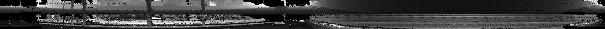
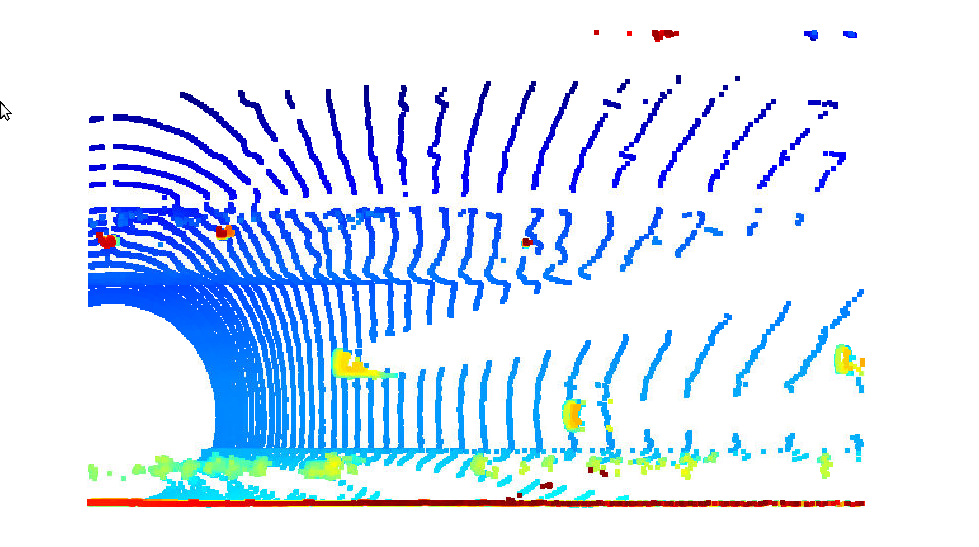
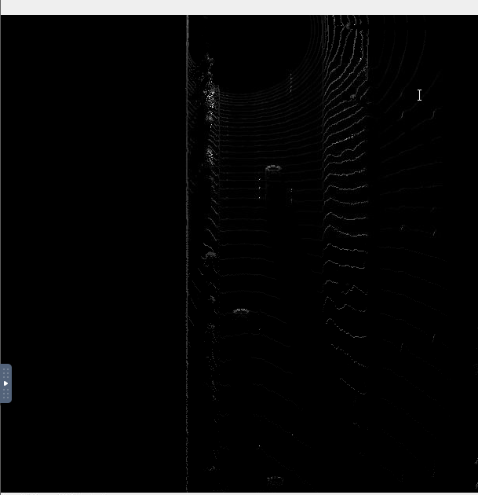
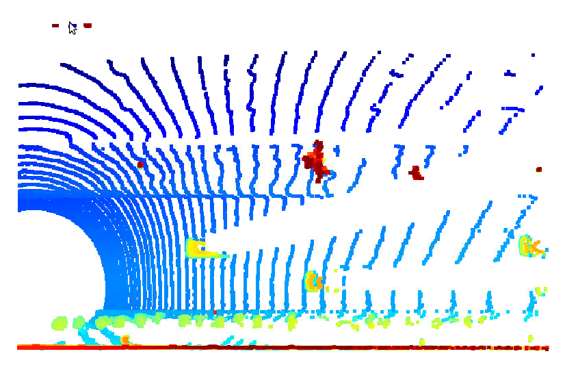
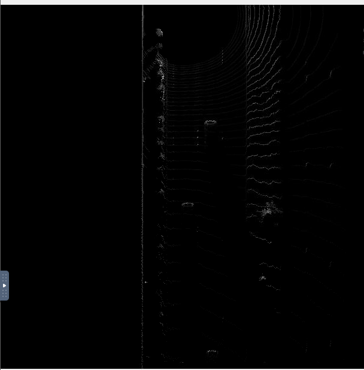
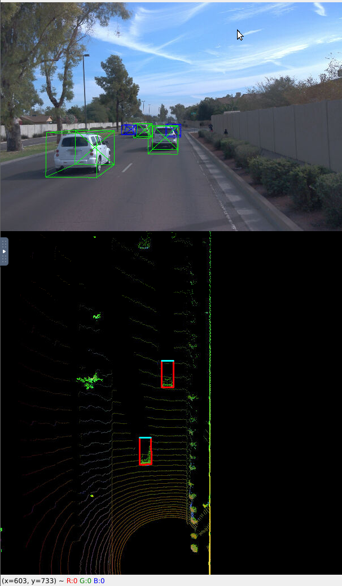
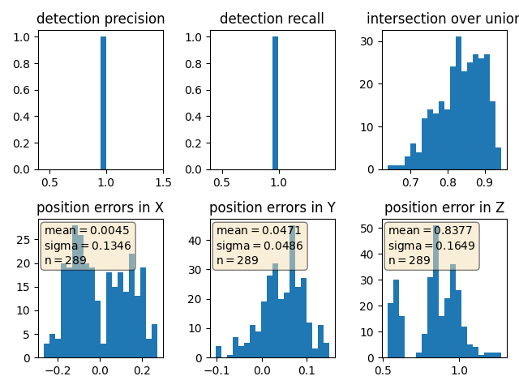
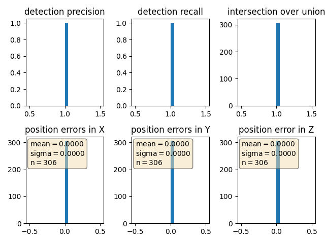

# Writeup: Track 3D-Objects Over Time

To run our code, we can run at workspace with next command:

```
python loop_over_dataset.py
```

In each exercise, there are different combination of configurations need to use for each point.

### 1. Write a short recap of the four tracking steps and what you implemented there (filter, track management, association, camera fusion). Which results did you achieve? Which part of the project was most difficult for you to complete, and why?

#### Section 1 : Compute Lidar Point-Cloud from Range Image

In this section, the need is to show range image. For this, image have to converted to 8 bit channel in range and intensity, and stack the range and intensity image vertically.

The result will be the following image:



#### Section 2 : Create Birds-Eye View from Lidar PCL

Using Lidar Point-Cloud, have to compute the respective coordinates within the BEV coordinate space, and fill the BEV map with lidar data from the point-cloud.


The "intensity" channel of the BEV map can be filled indentifying all points with same coordinates and assigning the intensity value of the top-most lidar point to the respective BEV pixel.


#### Section 3 : Model-based Object Detection in BEV Image




Using three-channel BEV map, 3D bounding boxes can be generated to image showing perfectly vehicles and its dimensions.

To create **labels vs detected** image, in **loop_over_dataset.py**  results_fullpath variable must to be modified because path generated was not correct.

At image can observe the cars inside bounding boxes.


#### Section 4 : Performance Evaluation for Object Detection

To get statistics, all window visualization has been commented to avoid to press right key in all images.

1. With **use_labels_as_objects = False** results obtained are:

    ```
    precision = 0.9506578947368421, recall = 0.9444444444444444
    ```

    

2. With **use_labels_as_objects = True** results obtained are:

    ```
    precision = 1.0, recall = 1.0
    ```

    

Without using labels as objects the performance achieved is very good, but, not reliable at 100%. Instead this, using labels as objects, there are not error and system is 100% reliable.
### 2. Do you see any benefits in camera-lidar fusion compared to lidar-only tracking (in theory and in your concrete results)? 

Mixing different sensor more data can be achieved. This improvement can help to locate better other objects, giving option to get better decisions. 

At Section 3, 3D bounding boxes shows more cars than intensity map, but, with intensity map and previous image, system can be sure that there are at least two cars near the recording car.


### 3. Which challenges will a sensor fusion system face in real-life scenarios? Did you see any of these challenges in the project?

Position achieved for each device can be different and this can produce to system having a bad decisions. Weather and visibility conditions limits some systems reliability, so, different characteristics devices can improve performance on obstacle recognition.


### 4. Can you think of ways to improve your tracking results in the future?

Filtering results of sensor data can improve all system. Also, camara training in all conditions and lot of different configurations, can help to be prepared for further problems. Adding to each vehicle GPS system and sharing throught internet the information in real time, can be also used to position correctly this vehicles.