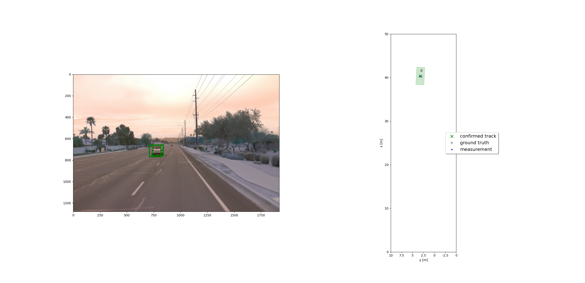
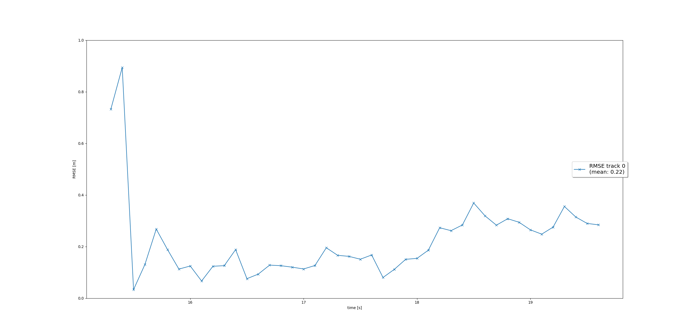
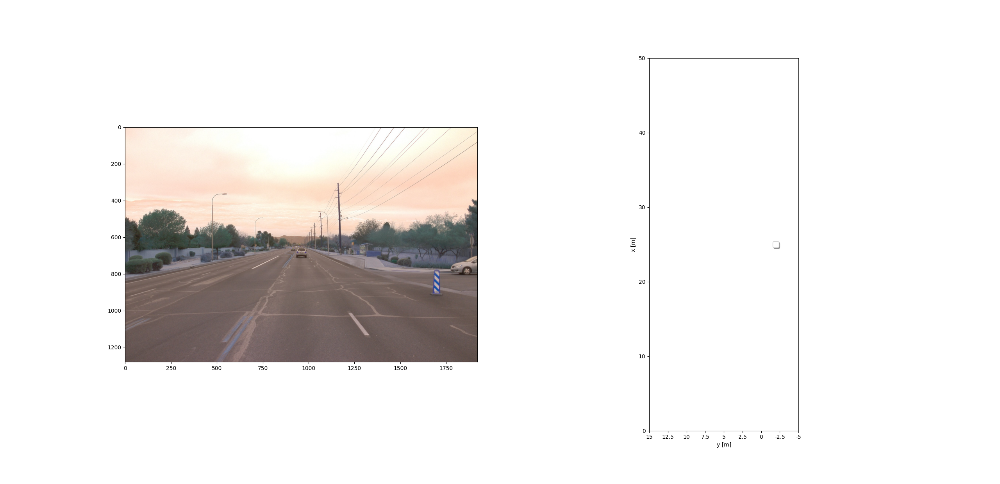
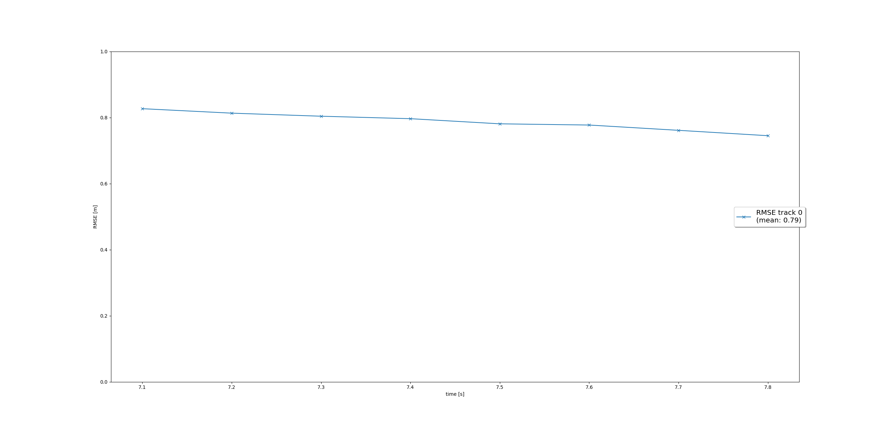
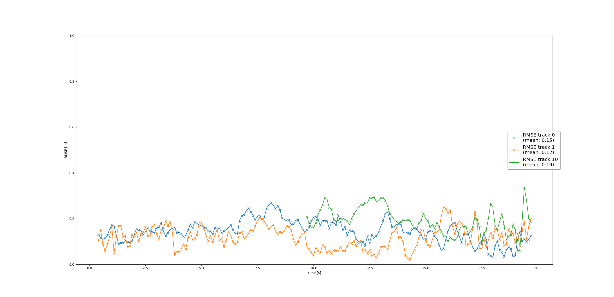
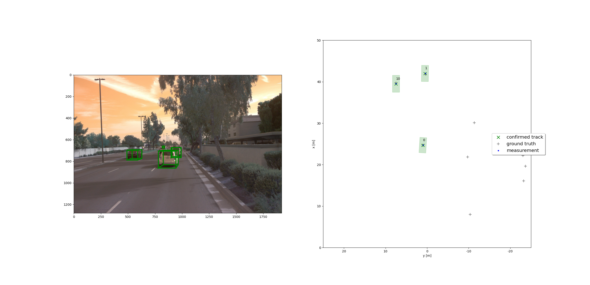
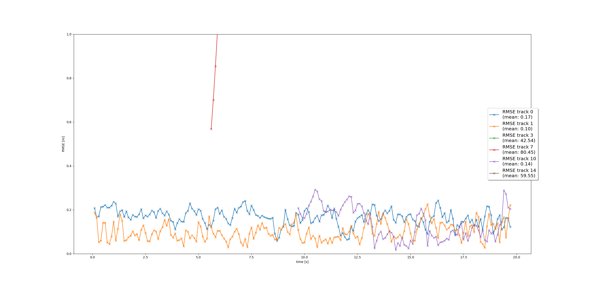

# Writeup: Track 3D-Objects Over Time

Please use this starter template to answer the following questions:

### 1. Write a short recap of the four tracking steps and what you implemented there (filter, track management, association, camera fusion). Which results did you achieve? Which part of the project was most difficult for you to complete, and why?

1. **Filter**, Kalman filter is used. The filter allows to predict next speed and position of object.

2. **Track management** Is used to manage detected cars with previously detected, or cars previosly detected and in new scenarios doesn't appear. Have to give some score of each object to know if is a real object or wrong detection.

3. **Association** Associate new measurements with already available data of sensors.

4. **Camera fusion** With 2D matrix, helps to ensure that object detected by lidar are correct.

Achieved results are almost good, but should be adjusted to get better results to work really with them. Improving Filter F and Q matrix values, can help in this work.

The most difficult part has been putting all matrix dimensions in proper way to do all aritmethics. I don't have enough background doing code to use matrix.

### 2. Do you see any benefits in camera-lidar fusion compared to lidar-only tracking (in theory and in your concrete results)? 

Lidar-only can detect objects using its size and volume. Camera, can use object recognition to know if detected object is a vehicle or not, improving matching results and reducing false positive detections.

In some frames, lidar detects a house like a car, but camera not.

### 3. Which challenges will a sensor fusion system face in real-life scenarios? Did you see any of these challenges in the project?

Need to have enough precision with only sensor like with multiple, because, depending position, some objects can be detected only with one of the sensors and must be reliable information obtained with that sensor. Other problem will be processing time and time of taking decision. If computer which is doing the calcs performance is low, maybe decisions can be take too slow and car reaction will be late.

During project, computation performance problems are visible when executing tests, so, in embedded systems, where almost most of them has lower performance, can be problematic.

### 4. Can you think of ways to improve your tracking results in the future?

Adding different cameras in different angles can help improving vehicle detection. Also, adding other kind of sensors, can help improving, as well as knowing each vehicle position in each moment or having communication between vehicles.

### 5. Results

#### 1. Step 1
|  |  | 
|:-:|:-:|
#### 2. Step 2
|  |  | 
|:-:|:-:|
#### 3. Step 3
|  |  | 
|:-:|:-:|
#### 4. Step 4
|  |  | 
|:-:|:-:|

To see movie generated in step 4, go to **Own_results/Final/Step4** folder and check **my_tracking_results.avi** video file.